Job Portal Web Application

A full-stack Job Portal Web Application built using Flask, SQLAlchemy, HTML, CSS, Bootstrap, and SQLite.
This platform allows employers to post/manage jobs and job seekers to search and apply for job listings.
It also includes Admin controls, authentication, and dashboard interfaces.

📌 Features

👤 User Authentication

Register (Admin / Employer / Job Seeker)

Login / Logout

Forgot & Reset Password

🏢 Employer Features

Post new job listings

Edit & manage existing jobs

View number of job applications

🙍‍♂️ Job Seeker Features

Search for jobs

Apply to jobs

🛠️ Admin Features

Manage all users

Manage job listings

🧱 Tech Stack

Backend

Python (Flask)

SQLAlchemy ORM

Frontend

HTML, CSS, Bootstrap

Database

SQLite

📁 Project Structure

Job_Portal_Web_Application/

│── app.py

│── requirements.txt

│── .gitignore

│── migrations/ # Auto-generated by Flask-Migrate

│── templates/

│   ├── base.html

│   ├── index.html

│   ├── login.html

│   ├── register.html

│   ├── forgot_password.html

│   ├── reset_password.html

│   ├── employer_dashboard.html

│   ├── jobseeker_dashboard.html

│   ├── admin_dashboard.html

│   ├── post_job.html

│   ├── edit_job.html

│── README.md

│── assets/            # Screenshot images

🚀 How to Run Locally

1️⃣ Clone the Repository
git clone https://github.com/yourusername/job-portal-web-app.git
cd job-portal-web-app

2️⃣ Create Virtual Environment

python -m venv venv

Activate environment:

Windows

venv\Scripts\activate

Mac / Linux

source venv/bin/activate

3️⃣ Install Dependencies
pip install -r requirements.txt

4️⃣ Run Database Migrations
flask db upgrade

or

python app.py

5️⃣ Start the Application
flask run

or

python app.py

Open your browser and go to:
👉 http://127.0.0.1:5000

📝 Create a .env File

Create a .env in the project root and add:

SECRET_KEY=your_secret_key_here
MAIL_USERNAME=your_email
MAIL_PASSWORD=your_password   # App password if using Gmail

📸 Screenshots
🛡️ Admin Dashboard
View 1

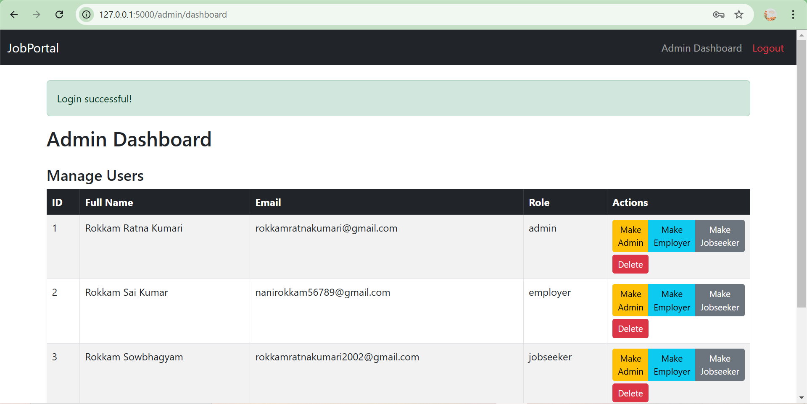

View 2

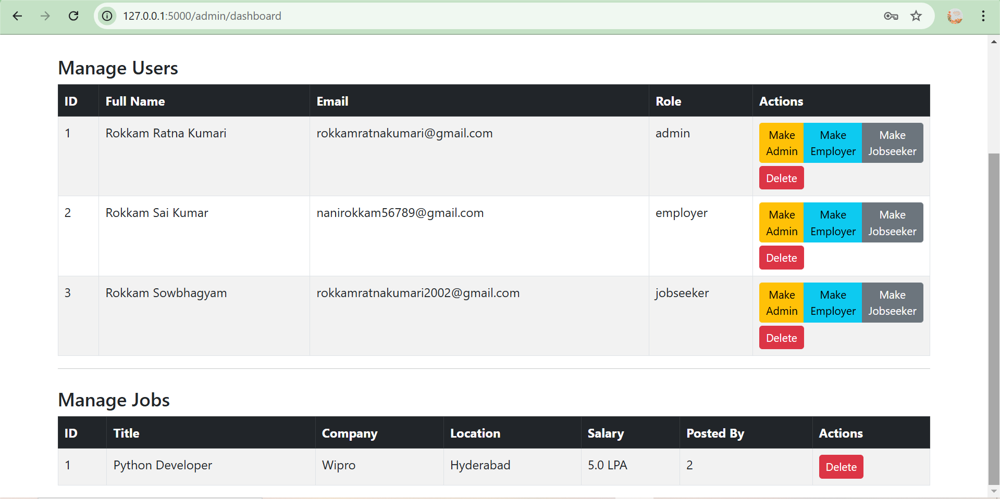

🏢 Employer Interface
Employer Dashboard

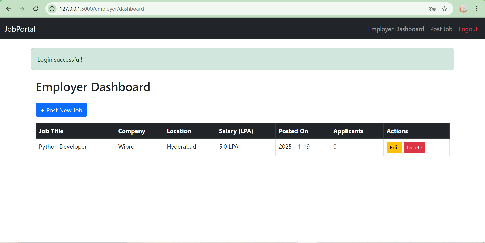

📝 New Job Posting
Page 1

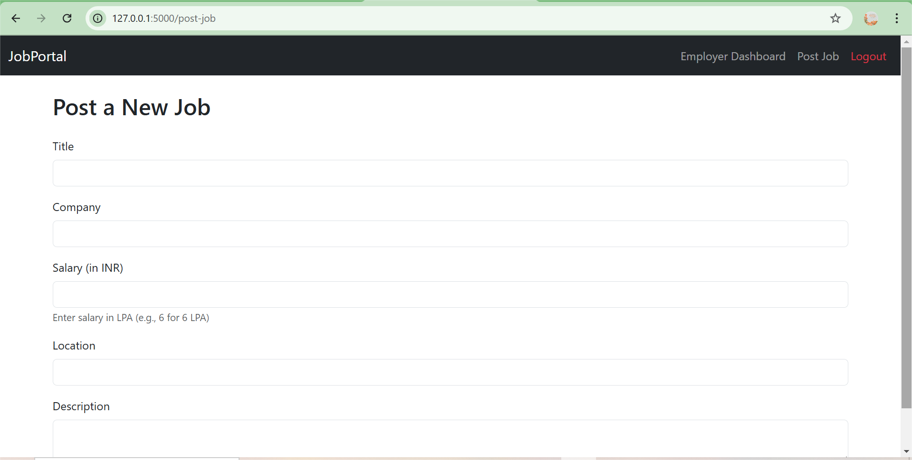

Page 2

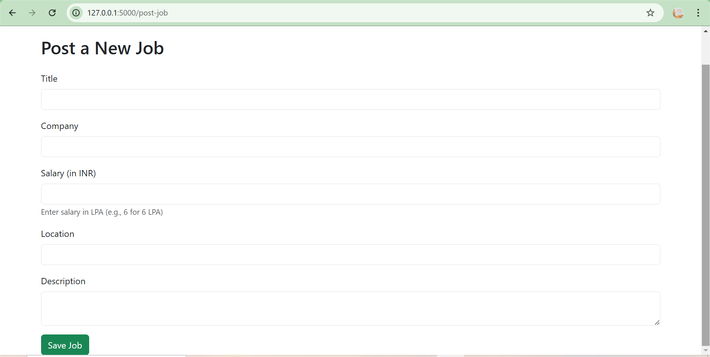

✏️ Job Editing
Page 1

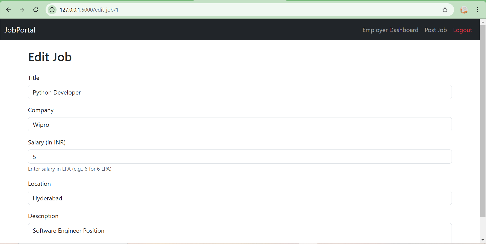

Page 2

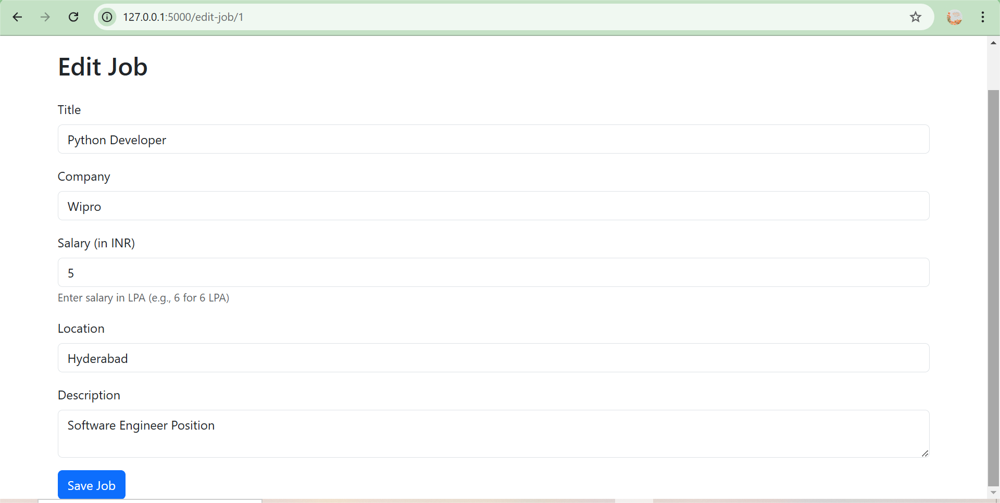

🙍‍♂️ Job Seeker Interface
Dashboard

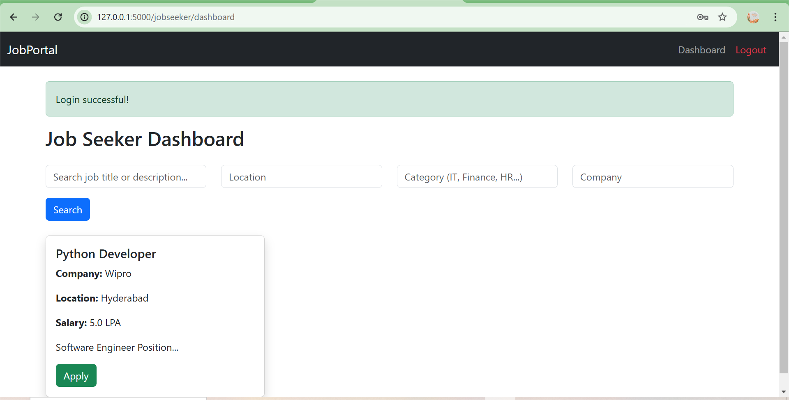

🔐 Authentication Screens
Login Page

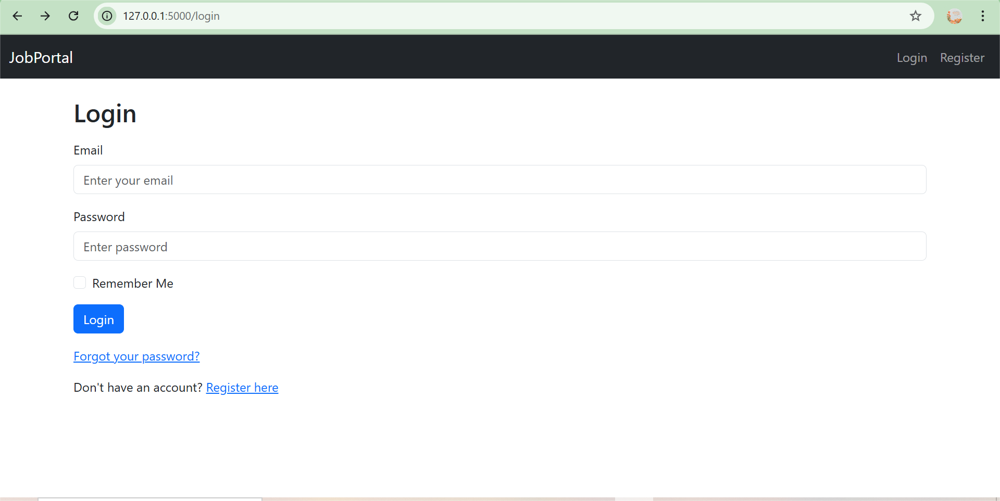

Register Page – Step 1

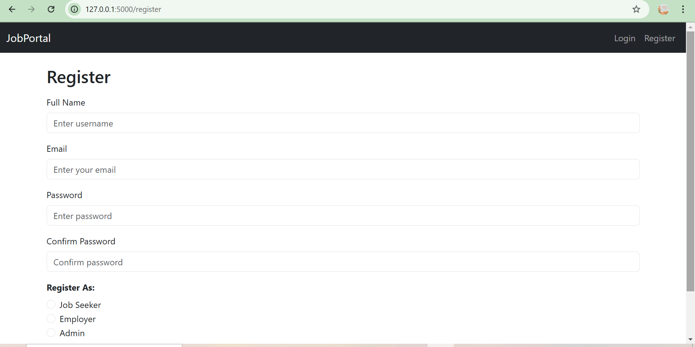

Register Page – Step 2

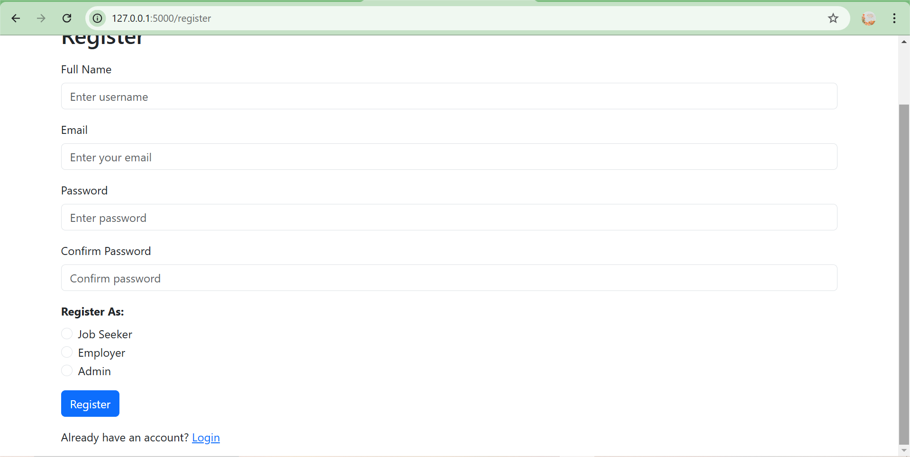

📬 Contact

For any issues or suggestions, feel free to open an Issue on GitHub.

